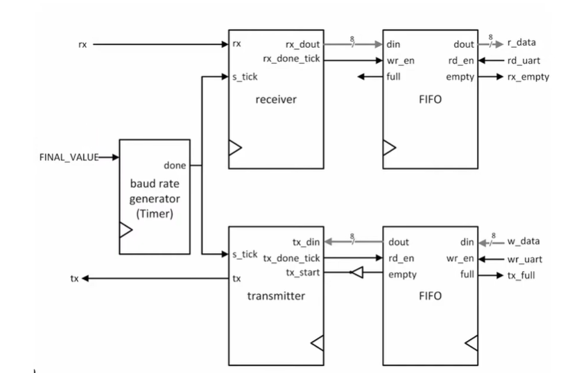

# UART Verilog Implementation

This project provides a Register Transfer Level (RTL) Verilog implementation of an **d-bit(generic bits) UART (Universal Asynchronous Receiver-Transmitter)** designed for FPGA synthesis using **Xilinx Vivado**.

It includes core UART modules such as a baud rate generator, receiver, and transmitter, along with a top-level wrapper to enable integration in custom digital designs.

The design includes core UART modules such as a baud rate generator, receiver, transmitter, and FIFO buffers, along with a top-level wrapper and a testbench for verification.

---

## 🔍 Overview

UART (Universal Asynchronous Receiver Transmitter) is a widely used serial communication protocol. This design supports:

- 1 start bit
- generic data bits
- 1 or 2 stop bits (configurable via sb_tick parameter, default: 1 stop bit)
- No parity
- Customizable baud rate through a baud rate generator
- FIFO buffers for handling transmit and receive data

The UART operates asynchronously and includes customizable baud rate support.
The design is fully synthesizable and optimized for FPGA implementation.

---

## 🧩 Modules

### `Baud_Rate_generator.v`
**Description**: Generates timing ticks for baud rate synchronization.  
**Parameters**:
- `max_bits`: Bit width of counter (default: 11)

**Inputs**:
- `clk`: System clock  
- `reset_n`: Active-low reset  
- `enable`: Counter enable  
- `Final_Value`: Determines baud rate (`Final_Value = (f / (16 * BR)) - 1`)  

**Output**:
- `done`: Tick signal

### `receiver.v`
**Description**: FSM for serial data reception.  
**Parameters**:
- `sb_tick`: Stop bit ticks (default: 16)  
- `dbits`: Data bits (default: 8)

**Inputs**:
- `clk`, `reset_n`  
- `rx`: Serial input  
- `s_tick`: Baud tick  

**Outputs**:
- `rx_dout`: Received data  
- `rx_done_tick`: Byte received pulse

### `transmitter.v`
**Description**: FSM-based UART transmitter.  
**Parameters**:
- `sb_tick`, `dbits`

**Inputs**:
- `clk`, `reset_n`  
- `s_tick`: Baud tick  
- `tx_din`: Data input  
- `tx_start`: Start transmission

**Outputs**:
- `tx_done_tick`: Done signal  
- `tx`: Serial output

### `FIFO.v`
**Description**: 16-element FIFO buffer.  
**Parameters**:
- `dbits`: Data width (default: 8)

**Inputs**:
- `clk`, `reset_n`  
- `wr_en`, `rd_en`  
- `buf_in`: Data in

**Outputs**:
- `buf_out`: Data out  
- `empty`, `full`, `fifo_counter`

### `UART_Top.v`

**Description**: Integrates all UART components.  
**Parameters**:
- `max_bits`: Baud rate counter width (default: 11)  
- `dbits`: Data width (default: 8)

**Inputs**:
- `clk`, `reset_n`, `Final_Value`, `rx`  
- `rd_uart`, `wr_uart`  
- `w_data`: TX FIFO input

**Outputs**:
- `tx`: Serial output  
- `rx_empty`: RX FIFO empty  
- `tx_full`: TX FIFO full  
- `r_data`: RX FIFO output

### `UART_tb.v`

**Description**: Testbench for UART design.  
**Features**:
- Generates 100 MHz clock  
- Simulates baud rate: 9600 (with Final_Value = 649 for 100 MHz)  
- Tests TX (data like `8'hA5`, `8'h0F`, `8'h78`)  
- Tests RX (data like `8'hA5`, `8'h3C`, `8'h32`)  
- Verifies FIFO status and read/write

---

## 📦 Dependencies

- No third-party IP cores
- Compatible with **Xilinx Vivado**
- Designed for 100 MHz system clock (can be changed)
- Works with other Verilog-compliant tools
  
---

## 🔢 Baud Rate Configuration

The baud rate determines the speed of UART communication and is set via the `Final_Value` input to the `Baud_Rate_generator` module (used inside `UART_Top.v`).

### 📐 Formula

Final_Value = (f_clk / (16 × Baud_Rate)) - 1

Where:
- `f_clk` is the system clock frequency in Hz (e.g., 100_000_000 for 100 MHz)
- `Baud_Rate` is the desired UART communication rate in bits per second (e.g., 9600)

### 📊 Example: 9600 Baud with 100 MHz Clock

Final_Value = (100_000_000 / (16 × 9600)) - 1 = 649

Set `Final_Value` to `11'd649` in your design to match this configuration.

### ⚠️ Notes

- The UART uses **16× oversampling**, so `Baud_Tick = 16 × Baud_Rate`
- Both transmitter and receiver must use the same `Final_Value`
- If using a different system clock, recalculate accordingly

---

## 📊 Block Diagram

## 📚 References

- **UART Lecture Series by Dr. Anas**  
  YouTube Playlist: [ECE 3300 - Digital Circuits Design Using Verilog – Dr. Anas](https://www.youtube.com/playlist?list=PL-iIOnHwN7NXw01eBDR7wI8KzGK4mu8Sr)  
  This project was inspired by and partially follows the concepts taught in the UART section of this lecture series. Highly recommended for learning Digital Design fundamentals, FSM design, and Verilog implementation techniques.

